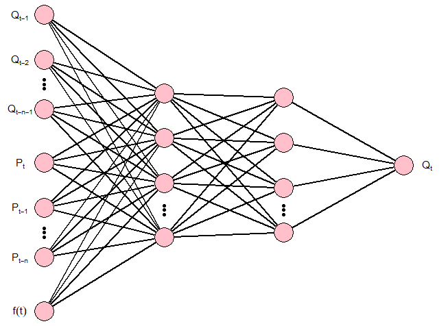

# (partially) Recurrent Neural Network (pRNN)

A deep feed-forward (DFF) Artificial Neural Network (ANN) is built to replicate the runoff hydrograph.  The inputs are $n$-day sequences of precipitation $P$ and discharge $Q$. The neural network is *"partially recurrent"* in that the discharge prediction made in a previous time step becomes the input to the following time step. The result is a trained network with the ability to make flow predictions with precipitation only. Training proceeds in 2 stages.

### Seed stage

To initialize the network, discharge is predicted using known discharge of the preceeding $n$-days:

$$
    \hat{Q}_t = E \left\{ Q_t | Q_{t-1}, Q_{t-2}, \dots , Q_{t-n-1}, P_t, P_{t-1}, \dots , P_{t-n}, f(\cdot) \right\}
$$

where $\hat{Q}\_t$ is the predicted discharge, $P$ is precipitation at time $t$, $Q\_{t-1}$ is the dsicharge observe on the day previous, and $f(\cdot)$ is a sinusoidal function ranging from 0 to 1 at the winter and summer solstices, respectively. In all, there are $2n+1$ inputs and 1 output: Runoff. User selects the number of hidden dense layers and the number of nodes per layer.

### Training stage

Once seeded, the model continuous to train for the complete data record set, for a user-set number of epochs.

$$
    \hat{Q}_t = E \left\{ Q_t | \hat{Q}_{t-1}, \hat{Q}_{t-2}, \dots , \hat{Q}_{t-n-1}, P_t, P_{t-1}, \dots , P_{t-n}, f(\cdot) \right\}
$$

Notice now the outputs $\hat{Q}$ are now fed into the input of the proceeding training round. This makes half of the ANN's inputs recurrent, making the network itself, partially recurrent. (Note: this formulation differs from typical Recurrent Neural Networks--RNN--where recurrency is applied at the node-level.) 

 

*Sample pRNN structure.*

 

## Source code

[GitHub](https://github.com/maseology/goANN)