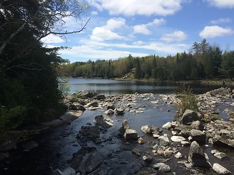

# Streamflow

The amount of water flowing in a stream is an important component of the water budget. Continuous collection of streamflow data provides insight into the volume of water released from groundwater storage, as it is that part of precipitation that has not been lost to the atmosphere or to deeper aquifer systems. Streamflows have traditionally been separated into two distinct components: those that occur periodically during and after storm events in the form of overland flow (i.e., runoff); and those that originate from groundwater sources that tend to persist year-long, namely baseflow or groundwater discharge. The latter typifies Oak Ridges Moraine streams.

The groundwater component of the streamflow hydrograph has frequently been approximated using automated baseflow separation techniques, with the understanding that long-term groundwater discharge amounts provide a preliminary estimate of long-term groundwater recharge amounts. In quantifying the groundwater recharge and improving the understanding of its linkage to discharge and in-stream flows needs, it is anticipated that partner agencies can make better informed decisions regarding the appropriate magnitude of groundwater that might be withdrawn for consumptive use from any particular watershed.

Analysis performed by the Oak Ridges Moraine Groundwater program on collected streamflow data is used to characterize the flow regime inherent to many of the moraine’s larger tributaries. Based on such characterizations, and with the aid of numerical groundwater flow models, impacts on water courses, from an altered water table (resulting for example, from increased pumping or from urbanization) can be estimated and better quantified. At-a-station measurements of streamflow and stage are obtained by the Water Survey of Canada and the various partner agencies and these data are updated regularly in the program’s database.

In addition to these data, over 13,000 spotflow measurements collected along much of the Oak Ridges Moraine and around Lake Simcoe provide hydrogeological insight by:
* Providing an indication of how significantly, and where, a particular stream is connected to the groundwater system by determining in the field where streams start, and the relative discharge occurring at that point;
* Understanding the spatial patterns of streamflow and their relationship to catchment drainage pathways and ecosystem connectivity; and
* Providing a good snapshot of regional hydrology that helps overcome the sparse distribution of existing long-term streamflow gauging stations.                                      

A summary map of stream profiles within the Oak Ridges Moraine boundary can be viewed <a href="https://maps.oakridgeswater.ca/Html5Viewer/index.html?viewer=ORMGPP&run=StreamflowProfiles#" target="_blank">here</a>.

<!-- [here](https://maps.oakridgeswater.ca/Html5Viewer/index.html?viewer=ORMGPP&run=StreamflowProfiles#). -->

<!-- <iframe src="https://maps.oakridgeswater.ca/Html5Viewer/index.html?viewer=ORMGPP&run=StreamflowProfiles#" width="100%" height="400"></iframe> -->

* [Hydrograph separation](hydrographseparation/)
* [hydrograph disaggregation](hydrographdisaggregation/)
* [Streamflow recession coefficient](recessioncoefficient/)
